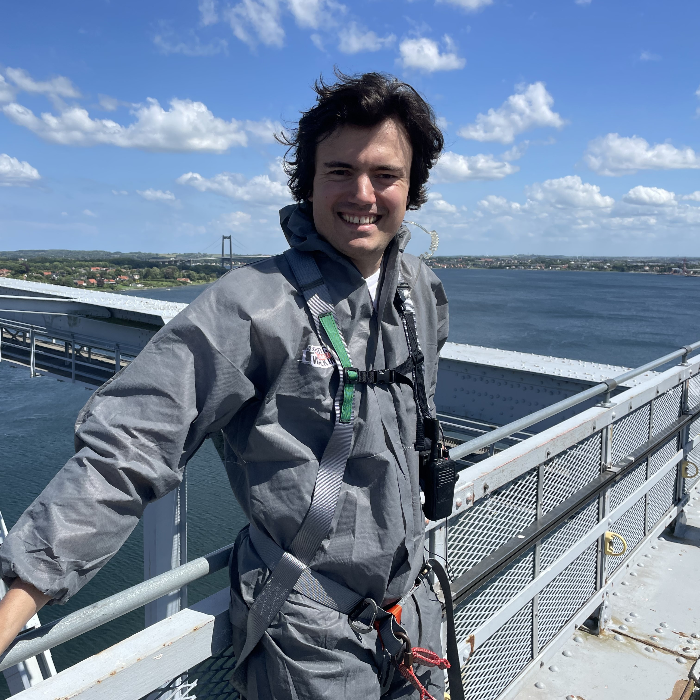
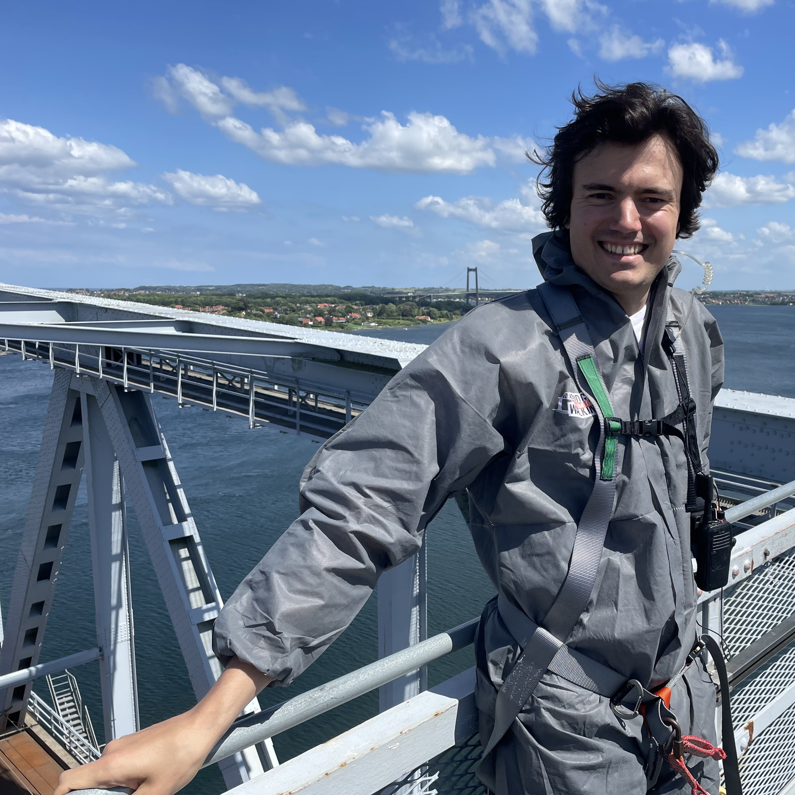

<!DOCTYPE html>
<html lang="en">
<head>
    <meta charset="UTF-8">
    <meta name="viewport" content="width=device-width, initial-scale=1.0">
    <title> Theo Glashier </title>
    <meta name="description" content="**My description**">
    <meta name="keywords" content="**My kewords**">
    <link rel="icon" href="bridge_walking_pic2.jpg" type="image/x-icon" >

    <!-- Include Bootstrap CSS -->
	<link href="https://cdn.jsdelivr.net/npm/bootstrap@5.3.3/dist/css/bootstrap.min.css" rel="stylesheet" integrity="sha384-QWTKZyjpPEjISv5WaRU9OFeRpok6YctnYmDr5pNlyT2bRjXh0JMhjY6hW+ALEwIH" crossorigin="anonymous">

    <!-- Include Bootstrap JS -->
	
	
</head>

<body>
    <header class="header">
        

            

                
                

                    <h1> Theo Glashier</h1>
                    
PhD Candidate

                    
Imperial College London

                    
Email: t.glashier21@imperial.ac.uk

                    
					

                        <a href="https://www.linkedin.com/in/theo-glashier-55b884171/"><i class="fa fa-linkedin"></i></a>
                        <a href="https://scholar.google.co.uk/citations?user=vmPWHDAAAAAJ&hl=en" target="_blank" title="Google Scholar"><i class="fas fa-graduation-cap"></i></a>
                    

                

            

        

    </header>

    <main class="content-container">
	    <section id="research-interests">
            <h2>Research Interests</h2>
			
<b>Research fields</b>: Structural Health Monitoring, Structural Damage Identification, Long-term monitoring of civil structures, Machine Learning.

            

                My research focuses on overcoming the challenges of long-term civil structural health monitoring (SHM), i.e. environmental and operational variability, poor data quality and identification of gradual deterioration, to enhance the maintenance workflow and budgets of civil infrastructure.
            

        </section>
		
        <section id="about">
            <h2>About Me</h2>      
            <h3>Summary</h3>
            <ul>
            </ul>
            
            <h3>Education</h3>
            <ul>
            </ul>
            
            <h3>Work Experience</h3>
            <ul>
            </ul>
	    <h3>Publications</h3>
	    
In the field of Civil Structural Health Monitoring. <a href="https://scholar.google.co.uk/citations?user=vmPWHDAAAAAJ&hl=en"><b>Google Scholar</b></a>

	    
<b>Selected publications</b>

		<ol>
        <li><strong>Glashier, Theo</strong>, Kromanis, Rolands, &amp; Buchanan, Craig (2024). An iterative regression-based thermal response prediction methodology for instrumented civil infrastructure. <em>Advanced Engineeing Informatics</em>, 60, 102347.<a href="https://www.sciencedirect.com/science/article/pii/S1474034623004755?via%3Dihub"><b>URL</b></a></li>
        <li><strong>Glashier, Theo</strong>, Kromanis, Rolands, &amp; Buchanan, Craig (2024). Temperature-based measurement interpretation of the MX3D Bridge <em>Engineeing Structures</em>, 305, 116736.<a href="https://www.sciencedirect.com/science/article/pii/S0141029623011513?via%3Dihub"><b>URL</b></a></li>
        </ol>
        </section>
		
		
        <section id="current-lab">
            <h2><a href="https://www.imperial.ac.uk/robotic-additive-manufacturing-lab/"><b>Robotic Additive Manufacturing Lab</b></a></h2>
            

                
            

			
Please feel free if you have any comments on our ongoing projects or any ideas that we can collaborate on. We will be very happy to discuss on it.

			
			<h3>Lab Members</h3>
            

                

                    
                    
 Craig Buchanan, PhD

                    
Senior Lecturer, Lead

                

                

                    
                    
Theo Glashier

                    
Research Postgraduate

                

				

                    
                    
Rony Reategui

                    
Research Postgraduate

                

				

                    
                    
Ankita Choudhury

                    
Research Postgraduate

                

            

		</section>
            
        <h3>Project Highlights</h3>            
				
		

		  

			<button type="button" data-bs-target="#carouselExampleCaptions" data-bs-slide-to="0" class="active" aria-current="true" aria-label="Slide 1"></button>
			<button type="button" data-bs-target="#carouselExampleCaptions" data-bs-slide-to="1" aria-label="Slide 2"></button>
			<button type="button" data-bs-target="#carouselExampleCaptions" data-bs-slide-to="2" aria-label="Slide 3"></button>
			<button type="button" data-bs-target="#carouselExampleCaptions" data-bs-slide-to="3" aria-label="Slide 4"></button>
			<button type="button" data-bs-target="#carouselExampleCaptions" data-bs-slide-to="4" aria-label="Slide 5"></button>
			<button type="button" data-bs-target="#carouselExampleCaptions" data-bs-slide-to="5" aria-label="Slide 6"></button>
			<button type="button" data-bs-target="#carouselExampleCaptions" data-bs-slide-to="6" aria-label="Slide 7"></button>
			<button type="button" data-bs-target="#carouselExampleCaptions" data-bs-slide-to="7" aria-label="Slide 8"></button>
			<button type="button" data-bs-target="#carouselExampleCaptions" data-bs-slide-to="8" aria-label="Slide 9"></button>
			<button type="button" data-bs-target="#carouselExampleCaptions" data-bs-slide-to="9" aria-label="Slide 10"></button>
		  

		  

		  
			

			  
			  

				<h5>University of Twente</h5>
				<h6>The MX3D Bridge was placed in a tent for load testing at the University of Twente, the Netherlands.</h6>
			  

			

			
			

			  
			  

				<h5>University of Twente</h5>
				<h6>Bottom view of the bridge with exposed data acquisition modules and cables of the permanent sensor network.</h6>
			  

			

			
			

			  
			  

				<h5>University of Twente</h5>
				<h6>The structure was left outside for 2 months during which the sensor network recorded its response.</h6>
			  

			

			
			

			  
			  

				<h5>Amsterdam</h5>
				<h6>The opening ceremony of the MX3D Bridge led by Queen Maxima.</h6>
			  

			

			
			

			  
			  

				<h5>Amsterdam</h5>
				<h6>The structure was exposed to varying conditions during its operation.</h6>
			  

			

			
			

			  
			  

				<h5>Amsterdam</h5>
				<h6>Photographing the full structure.

			  

			

			
			

			  
			  

				<h5>Amsterdam</h5>
				<h6 class="black-text" color=black;>Details of the capabilites of metal 3D-printing.</h6>
			  

			

			
			

			  
			  

				<h7 class="black-text" color=black;>Amsterdam</h7>
				
				<h8 class="black-text" color=black;>A proud PhD student.</h8>
			  

			

			
			

			  
			  

				<h5>Amsterdam</h5>
				<h6>The 'Smarter Bridge' team gathered at a conference in May 2022, so Craig and I took the opportunity to perform operational loading tests.</h6>
			  

			

			
			

			  
			  

				<h5>Amsterdam</h5>
				<h6>And we convinced others to also take part.</h6>
			  

			

			
		  

		  <button class="carousel-control-prev" type="button" data-bs-target="#carouselExampleCaptions" data-bs-slide="prev">
			
			Previous
		  </button>
		  <button class="carousel-control-next" type="button" data-bs-target="#carouselExampleCaptions" data-bs-slide="next">
			
			Next
		  </button>
		

    </main>

    <footer>
        

            
&copy; 2024 Theo Glashier.
			
        

    </footer>

    
</body>
</html>
